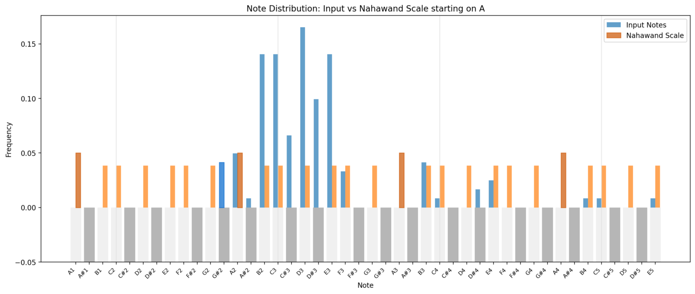

# MeloDetective: Maqam Detection

## Overview

MeloDetective is a tool for detecting Middle Eastern musical modes (maqams) in audio recordings. It leverages advanced audio processing algorithms and techniques to analyze melodies and identify the most likely maqam.


## How It Works


### Step-by-Step Process

1. **Audio to MIDI Conversion**:
   For audio files, we use Spotify's Basic Pitch to convert sound to MIDI. For best accuracy, uploading MIDI files directly is recommended.

2. **Frequency Analysis**:
   We analyze the input to extract frequency information and detect notes, which are essential for identifying maqams.

3. **Note Distribution Analysis**:
   We analyze the distribution of notes in the melody, focusing on which notes are used most frequently. Each maqam has a characteristic pattern of notes.

   

4. **Maqam Matching**:
   We compare the input melody with different maqams using a weighted accuracy scoring function:
   
   - For each maqam, we try all 12 possible semitone shifts (transpositions)
   - For each shift, we count how many input notes match the maqam scale
   - The accuracy score is the ratio of matching notes to total notes
   - We select the maqam and shift combination with the highest accuracy score
   
   This approach allows us to identify the maqam regardless of which note the melody starts on.

5. **Maqam Library**:
   Our system includes common Middle Eastern maqams:
   - **Ajam**: Similar to Western major scale
   - **Rast**: Similar to major scale but with a neutral third
   - **Nahawand**: Similar to Western minor scale
   - **Hijaz**: Features an augmented second between second and third degrees
   - **Kurd**: Similar to Western Phrygian mode
   - **Bayati**: Features a neutral second degree
   - **Saba**: Features a diminished fourth
   - **Siga**: Features neutral seconds and thirds

## Directory Structure

- **app.py**: Main application script for running the MeloDetective web interface.
- **audio_processing.py**: Contains functions for processing audio files.
- **maqam_core.py**: Core functionality for working with maqams.
- **maqam_constants.py**: Constants defining maqam scales and intervals.
- **maqam_definitions.py**: Detailed definitions of maqams.
- **maqam_analysis.py**: Functions for analyzing and detecting maqams.
- **maqam_visualization.py**: Tools for visualizing maqam detection results.
- **frequency_analysis.py**: Functions for analyzing frequencies in audio.
- **data/**: Directory for storing sample queries and library files.
- **requirements.txt**: Dependencies required for running MeloDetective.

## Installation

1. **Clone the Repository**:
    ```bash
    git clone https://github.com/shlomota/MeloDetective.git -b maqam_detection
    cd MeloDetective
    ```

2. **Install Dependencies**:
    ```bash
    pip install -r requirements.txt
    ```

3. **Run the Application**:
    ```bash
    streamlit run app.py
    ```

## Contributing

Contributions are welcome! Please open an issue or submit a pull request for any improvements or bug fixes.

## License

This project is licensed under the MIT License. See the [LICENSE](LICENSE) file for details.